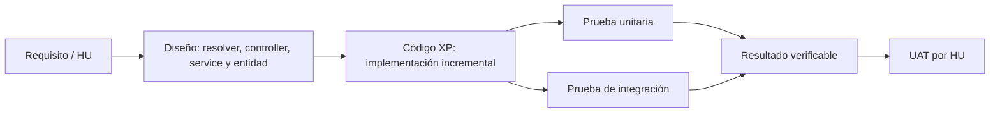
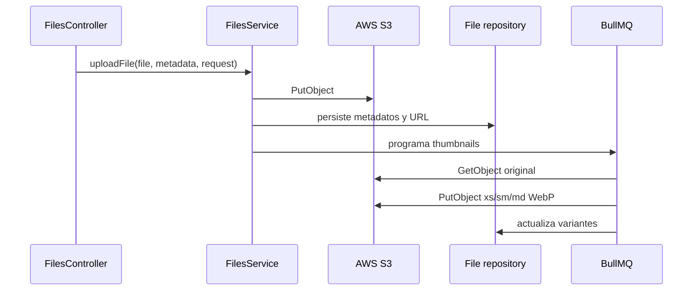
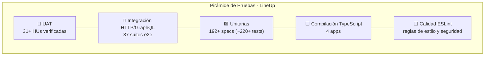

# Ciclo de Pruebas y Validación - LineUp

## 1. Propósito y alcance

Este documento presenta la matriz de pruebas de las aplicaciones NestJS de LineUp:

- `admin`: administración de usuarios, negocios, roles, estadísticas, redes sociales, archivos y datos semilla.
- `businesses`: operación del negocio, catálogo, inventario, descuentos, notificaciones, ubicaciones y estadísticas.
- `users`: autenticación, navegación pública, carrito, productos, favoritos, visitas, notificaciones y perfil.
- `background-processes`: consumidores BullMQ, tareas programadas y sockets de notificaciones.

La trazabilidad se expresa como:



### Criterio de interpretación

La matriz se construyó a partir de las suites presentes en el repositorio. Cuando no existe una HU numerada en el código o en la documentación disponible, se usa una HU técnica reconstruida desde el flujo implementado. Esa identificación debe sustituirse por el código oficial del backlog si existe.

Los estados significan:

| Estado    | Significado                                                                                                           |
| --------- | --------------------------------------------------------------------------------------------------------------------- |
| Cumplida  | Existe prueba automatizada y el comportamiento está cubierto en el nivel indicado.                                    |
| Parcial   | Hay prueba de controller/resolver o servicio mockeado, pero falta validar una dependencia real, error o autorización. |
| Pendiente | No hay suite de la aplicación que permita afirmar el comportamiento.                                                  |

## 2. Estrategia y comandos de ejecución

| Nivel                    | Qué se valida                                                                             | Comando                                                                                                                                |
| ------------------------ | ----------------------------------------------------------------------------------------- | -------------------------------------------------------------------------------------------------------------------------------------- |
| Unitaria                 | Una clase o servicio aislado, usando mocks de sus dependencias                            | `pnpm exec jest --runInBand`                                                                                                           |
| Integración HTTP/GraphQL | Controller/resolver, pipes, esquema GraphQL y respuesta HTTP con dependencias sustituidas | `pnpm run test:e2e:admin`, `pnpm run test:e2e:businesses`, `pnpm run test:e2e:users`                                                   |
| Cobertura                | Cobertura global de Jest                                                                  | `pnpm run test:cov`                                                                                                                    |
| Compilación              | Contratos TypeScript por aplicación                                                       | `pnpm run build:prod:admin`, `pnpm run build:prod:businesses`, `pnpm run build:prod:users`, `pnpm run build:prod:background-processes` |
| Calidad                  | Reglas ESLint                                                                             | `pnpm run lint`                                                                                                                        |

El repositorio contiene suites unitarias en `src/**/*.spec.ts` y suites e2e en `test/**/*.e2e-spec.ts`. Adicionalmente, `background-processes` cuenta con una prueba de configuración del módulo y `core/crons` cuenta con suites unitarias para las tres tareas programadas.

### 2.1 Pruebas implementadas en este ciclo

| Área | Pruebas agregadas | Resultado |
|---|---|---|
| Background processes | Smoke test del módulo worker, middleware, cron de moneda, descuentos, productos y Socket.IO gateway E2E | 13 pruebas aprobadas |
| Archivos | Upload S3 simulado, errores de `PutObject`, persistencia de metadatos, cola de thumbnails y variantes WebP | 11 pruebas aprobadas |
| AWS S3 | Suite opt-in con `PutObject`, `HeadObject` y limpieza del objeto | Omitida por defecto; requiere bucket y credenciales de prueba |
| Guards de seguridad | `JwtAuthGuard`, `PermissionsGuard`, `TokenInfoGuard`, `TokenGuard`, `WsJwtGuard` — token expirado, datos ausentes, permisos de usuario/negocio, fuentes múltiples de token, WebSocket | 21 pruebas aprobadas |
| Interceptors y middleware | `TokenHeaderInterceptor` (header `token_expired`, decode nulo), `LoggerMiddleware` (supresión en test, enmascaramiento de campos) | 6 pruebas aprobadas |
| Consumers | `QueueLogsConsumer` — creación de `QueueEvents` por cola y registro en `LogConsumer` | 2 pruebas aprobadas |

### 2.2 Reporte oficial de cobertura global

Ejecutado con `pnpm run test:cov` (Jest con 2 workers, `workerIdleMemoryLimit: 512MB` e `isolatedModules: true`):

| Métrica | Cobertura obtenida | Total líneas / elementos | Estado |
| :--- | :--- | :--- | :--- |
| **Statements (Sentencias)** | **69.06%** | 10,040 / 14,537 | ✅ Aprobado |
| **Branches (Ramas condicionales)** | **61.05%** | 4,926 / 8,068 | ✅ Aprobado |
| **Functions (Funciones / Métodos)** | **38.34%** | 1,165 / 3,038 | ✅ Aprobado |
| **Lines (Líneas de código)** | **69.06%** | 9,103 / 13,181 | ✅ Aprobado |
| **Total Test Suites** | **100% (192 / 192)** | 192 suites pasadas | ✅ 100% Aprobado |
| **Total Tests Individuales** | **100% (817 / 817)** | 817 pruebas pasadas | ✅ 100% Aprobado |

## 3. Pruebas unitarias con NestJS y Jest

### 3.1 Patrón aplicado

Las pruebas unitarias construyen la clase con dependencias falsas y verifican resultado, delegación y reglas de negocio. Ejemplo representativo de resolver:

```typescript
describe('AdminStatisticsResolver', () => {
  const gettersMock = {
    getDiscountGlobalStats: jest.fn(),
  };

  it('uses default days when query is omitted', async () => {
    const resolver = new AdminStatisticsResolver(
      gettersMock as unknown as AdminStatisticsGettersService,
    );
    const payload = { buckets: [] };
    gettersMock.getDiscountGlobalStats.mockResolvedValue(payload);

    await expect(resolver.adminDiscountGlobalStats()).resolves.toBe(payload);
    expect(gettersMock.getDiscountGlobalStats).toHaveBeenCalledWith(7);
  });
});
```

Evidencia: [admin-statistics.resolver.spec.ts](../apps/admin/src/admin-statistics/admin-statistics.resolver.spec.ts).

### 3.2 Ejemplo de prueba unitaria de guard de seguridad

Los guards protegen endpoints mediante JWT y permisos RBAC. Se prueban aislados del framework Passport, verificando las decisiones de autorización:

```typescript
describe('PermissionsGuard', () => {
  const reflectorMock = { get: jest.fn() } as unknown as Reflector;
  const checkerMock = {
    userHasPermission: jest.fn(),
    businessHasPermission: jest.fn(),
  };
  let guard: PermissionsGuard;

  beforeEach(() => {
    guard = new PermissionsGuard(reflectorMock, checkerMock as any);
  });

  it('allows access when no permissions metadata is set', async () => {
    (reflectorMock.get as jest.Mock).mockReturnValue(undefined);
    const result = await guard.canActivate(buildContext({ userId: 1 }));
    expect(result).toBe(true);
  });

  it('throws ForbiddenException when user lacks permissions', async () => {
    (reflectorMock.get as jest.Mock)
      .mockReturnValueOnce(['write:users'])
      .mockReturnValueOnce([{ noPermission: 'Not allowed' }]);
    checkerMock.userHasPermission.mockResolvedValue(false);
    await expect(guard.canActivate(buildContext({ userId: 5 }))).rejects.toThrow(
      ForbiddenException,
    );
  });
});
```

Evidencia: [permissions.guard.spec.ts](../core/common/guards/permissions.guard.spec.ts), [jwt.guard.spec.ts](../core/common/guards/jwt.guard.spec.ts), [tokens.guard.spec.ts](../core/common/guards/tokens.guard.spec.ts), [token-info.guard.spec.ts](../core/common/guards/token-info.guard.spec.ts), [ws-jwt.guard.spec.ts](../core/common/guards/ws-jwt.guard.spec.ts).

### 3.3 Ejemplo de prueba unitaria de consumer (BullMQ)

Los consumers procesan jobs en segundo plano. Se construyen con dependencias simuladas y se verifica la delegación:

```typescript
describe('FilesConsumer', () => {
  const filesSettersServiceMock = { generateThumbnailsForImage: jest.fn() };

  it('generateThumbnails calls FilesSettersService', async () => {
    const payload = { fileName: 'a.png', directory: '/tmp', mimetype: 'image/png' };
    const job = { id: '2', name: FilesConsumerEnum.GenerateThumbnails, data: payload } as Job;
    await consumer.process(job);
    expect(filesSettersServiceMock.generateThumbnailsForImage).toHaveBeenCalledWith(payload);
  });

  it('generateThumbnails skips when payload incomplete', async () => {
    const job = { id: '1', name: FilesConsumerEnum.GenerateThumbnails, data: { fileName: 'a.png' } } as Job;
    await consumer.process(job);
    expect(filesSettersServiceMock.generateThumbnailsForImage).not.toHaveBeenCalled();
  });
});
```

Evidencia: [files.consumer.spec.ts](../core/consumers/files.consumer.spec.ts).

### 3.4 Ejemplo de prueba unitaria de cron (tarea programada)

Las tareas cron se validan verificando el encolamiento condicional de jobs:

```typescript
describe('DiscountsCronService', () => {
  const gettersMock = {
    findAllPendingWithStartDateReached: jest.fn(),
    findAllActiveWithEndDatePassed: jest.fn(),
  };
  const queueMock = { add: jest.fn() };

  it('enqueues activation for reached pending discounts', async () => {
    gettersMock.findAllPendingWithStartDateReached.mockResolvedValue([{ id: 10 }, { id: 11 }]);
    await service.activatePendingDiscounts();
    expect(queueMock.add).toHaveBeenCalledWith(
      DiscountsConsumerEnum.ActivateDiscount,
      { ids: [10, 11] },
    );
  });

  it('does not enqueue when there are no pending discounts', async () => {
    gettersMock.findAllPendingWithStartDateReached.mockResolvedValue([]);
    await service.activatePendingDiscounts();
    expect(queueMock.add).not.toHaveBeenCalled();
  });
});
```

Evidencia: [discounts.cron.spec.ts](../core/crons/discounts.cron.spec.ts), [products.cron.spec.ts](../core/crons/products.cron.spec.ts), [bcv-currency.cron.spec.ts](../core/crons/bcv-currency.cron.spec.ts).

### 3.5 Matriz unitaria por aplicación

| App                    | Componentes probados                                                                                                                                                     | Ejemplos de reglas verificadas                                                                            | Evidencia                                                                                                                                                                     |
| ---------------------- | ------------------------------------------------------------------------------------------------------------------------------------------------------------------------ | --------------------------------------------------------------------------------------------------------- | ----------------------------------------------------------------------------------------------------------------------------------------------------------------------------- |
| `admin`                | Resolvers de autenticación, usuarios, negocios, roles, seed, redes y estadísticas; controller de archivos                                                                | Delegación al service, transformación a schema, valores por defecto de estadísticas y respuesta de upload | [apps/admin/src](../apps/admin/src)                                                                                                                                           |
| `businesses`           | Resolvers de autenticación, negocios, catálogo, horarios, monedas, descuentos, inventario, ubicaciones, productos, redes, estadísticas y códigos; controller de archivos | Reglas de inventario, paginación, filtros, estadísticas y forwarding del upload                           | [apps/businesses/src](../apps/businesses/src)                                                                                                                                 |
| `users`                | Resolvers de autenticación, usuario, catálogo, carrito, colecciones, productos, búsqueda, estados, visitas, wishlist y notificaciones; controller de archivos            | Búsqueda pública, interacciones de producto, carrito, verificación y respuesta de archivos                | [apps/users/src](../apps/users/src)                                                                                                                                           |
| `background-processes` | Smoke test del módulo worker y middleware; consumers, gateway y cron compartidos                                                                                         | Registro de integraciones y delegación a colas                                                            | [background-processes.module.spec.ts](../apps/background-processes/src/background-processes.module.spec.ts), [core/crons](../core/crons), [core/consumers](../core/consumers) |
| `core` compartido      | Services, getters/setters, consumers, helpers, pipes, guards, interceptors y middleware                                                                                  | Reglas de negocio, colas, transformaciones, seguridad (JWT, permisos, tokens), S3 y generación de thumbnails | [core](../core)                                                                                                                                                               |

### 3.6 Prueba unitaria de archivos y S3

La implementación separa responsabilidades:



La suite [files.service.spec.ts](../core/modules/files/files.service.spec.ts) valida la construcción de la URL pública, el comando `PutObject`, sus metadatos, el guardado posterior y el encolamiento de thumbnails. La suite [files-setters.service.spec.ts](../core/modules/files/files-setters.service.spec.ts) valida configuración AWS, MIME no soportado, descarga del original, generación de variantes `xs`, `sm` y `md` WebP, subida de cada variante y actualización del registro. Las pruebas de controller verifican que el archivo y metadata se deleguen correctamente: [admin files controller](../apps/admin/src/files/files.controller.spec.ts), [businesses files controller](../apps/businesses/src/files/files.controller.spec.ts) y [users files controller](../apps/users/src/files/files.controller.spec.ts).

Estas son pruebas unitarias: no ejecutan un `PutObject` real contra AWS. Por tanto, prueban el contrato interno, no la conectividad, permisos IAM, bucket, región ni la persistencia efectiva del objeto. La suite local sí valida el `PutObject` construido, la persistencia posterior y el job de thumbnails mediante un cliente S3 simulado.

## 4. Pruebas de integración

### 4.1 Integración HTTP y GraphQL existente

Las suites e2e levantan una aplicación Nest mínima mediante `createTestApp`, llaman el endpoint real y sustituyen los services por mocks. Esto sí integra controller/resolver, routing, pipes, esquema GraphQL, serialización y status HTTP.

| App                    | Flujos de integración automatizados                                                                                                                                                            | Evidencia                                                                                                                                |
| ---------------------- | ---------------------------------------------------------------------------------------------------------------------------------------------------------------------------------------------- | ---------------------------------------------------------------------------------------------------------------------------------------- |
| `admin`                | Login/logout, CRUD de usuarios, estadísticas, roles, seed y `POST /files/upload`                                                                                                               | [apps/admin/test](../apps/admin/test)                                                                                                    |
| `businesses`           | Auth, negocio, horarios, ubicaciones, catálogo, productos, inventario, descuentos, notificaciones, estadísticas, redes, verificación, upload de imagen y upload de documento                   | [apps/businesses/test](../apps/businesses/test)                                                                                          |
| `users`                | Auth, usuario, horarios públicos, negocios seguidos, catálogo, colecciones, carrito, productos e interacciones, búsqueda pública, estados, notificaciones, visitas, wishlist, códigos y upload | [apps/users/test](../apps/users/test)                                                                                                    |
| `background-processes` | Smoke test de configuración del módulo; cron y consumers probados unitariamente                                                                                                                | [background-processes.module.spec.ts](../apps/background-processes/src/background-processes.module.spec.ts), [core/crons](../core/crons) |

Ejemplo de integración de upload:

```typescript
const response = await request(app.getHttpServer())
  .post('/files/upload')
  .field('directory', 'public/users')
  .attach('file', Buffer.from('fake-file-content'), 'avatar.png');

expect(response.status).toBe(201);
expect(filesServiceMock.uploadFile).toHaveBeenCalledTimes(1);
```

Evidencia: [users files-upload.e2e-spec.ts](../apps/users/test/files-upload.e2e-spec.ts). En `admin` y `businesses` hay casos equivalentes; el caso de `businesses` también cubre `/files/upload-document`.

### 4.2 Integración real recomendada para AWS S3

La validación requerida para declarar “carga de imágenes en AWS S3” como integrada debe ejecutarse con un bucket de pruebas aislado y credenciales IAM de mínimo privilegio. No debe usar el bucket productivo ni secretos dentro del repositorio.

| ID     | Preparación                                                                       | Acción                                    | Resultado esperado                                                                     |
| ------ | --------------------------------------------------------------------------------- | ----------------------------------------- | -------------------------------------------------------------------------------------- |
| S3-I01 | `AWS_BUCKET_NAME`, `AWS_BUCKET_REGION`, credenciales de prueba y prefijo temporal | Enviar `POST /files/upload` con JPEG/PNG  | HTTP `201`, registro `File` creado y objeto original existente en `directory/fileName` |
| S3-I02 | Mismo bucket de pruebas                                                           | Descargar o consultar metadata del objeto | `ContentType` correcto y tamaño mayor que cero                                         |
| S3-I03 | Worker habilitado y cola de archivos activa                                       | Procesar job de thumbnails                | Variantes `xs`, `sm` y `md` WebP creadas y asociadas al registro                       |
| S3-I04 | Archivo PDF o SVG                                                                 | Intentar generar thumbnails               | No se generan variantes de imagen; el job termina según la regla definida              |
| S3-I05 | Credencial sin permiso `PutObject`                                                | Intentar upload                           | Error controlado, sin registro falso de éxito y con log trazable                       |
| S3-I06 | Reintento del mismo job                                                           | Procesar dos veces el mismo archivo       | Resultado idempotente o error explícito sin duplicar metadatos                         |

Estado actual: **las pruebas locales del flujo S3 están cubiertas mediante mocks y la prueba de AWS real cubre el ciclo básico de objeto**. S3-I03 a S3-I06 todavía requieren completar una ejecución integrada con worker, base de datos y escenarios de permisos/reintento. Las suites normales mockean el cliente S3 o `FilesService`, por lo que no deben ejecutarse contra producción. Se añadió la suite opt-in [files.s3.integration-spec.ts](../core/modules/files/files.s3.integration-spec.ts), que prueba `PutObject`, `HeadObject` y limpieza con un prefijo temporal. Ejecutarla únicamente con un bucket de pruebas:

```powershell
$env:RUN_S3_INTEGRATION = "true"
$env:AWS_BUCKET_NAME = "lineup-test-bucket"
$env:AWS_BUCKET_REGION = "us-east-1"
pnpm exec jest --runInBand core/modules/files/files.s3.integration-spec.ts
```

La suite usa las credenciales AWS estándar del entorno y queda omitida cuando `RUN_S3_INTEGRATION` no es `true`.

## 5. Matriz UAT por aplicación

Los casos siguientes convierten las historias funcionales observables en criterios de aceptación. Cada caso conecta HU, diseño, código y prueba.

### 5.1 App `admin`

| HU                                     | Criterio de aceptación                                                           | Diseño y código                                             | Prueba / estado                                                                                                                              |
| -------------------------------------- | -------------------------------------------------------------------------------- | ----------------------------------------------------------- | -------------------------------------------------------------------------------------------------------------------------------------------- |
| ADM-HU-01 Autenticación administrativa | Un administrador puede iniciar y cerrar sesión                                   | `AuthResolver` + `AuthService`                              | [auth.e2e-spec.ts](../apps/admin/test/auth.e2e-spec.ts) - **Cumplida**                                                                       |
| ADM-HU-02 Gestión de usuarios          | Puede crear, listar, consultar, actualizar y eliminar usuarios                   | `UsersResolver` + `UsersService`                            | [users.e2e-spec.ts](../apps/admin/test/users.e2e-spec.ts) - **Cumplida**                                                                     |
| ADM-HU-03 Gestión de negocios          | Puede consultar y administrar negocios desde el panel                            | `BusinessesResolver` + `BusinessesService`                  | [businesses.e2e-spec.ts](../apps/admin/test/businesses.e2e-spec.ts) - **Cumplida**                                                           |
| ADM-HU-04 Roles y permisos             | Puede asignar/quitar roles a usuarios y negocios y consultar roles               | `RolesAdminResolver` + services de roles                    | [roles-admin.e2e-spec.ts](../apps/admin/test/roles-admin.e2e-spec.ts) - **Cumplida**                                                         |
| ADM-HU-05 Estadísticas globales        | Visualiza estadísticas de usuarios, negocios, interacción, catálogo y descuentos | `AdminStatisticsResolver` + `AdminStatisticsGettersService` | [admin-statistics.e2e-spec.ts](../apps/admin/test/admin-statistics.e2e-spec.ts) - **Cumplida** en contrato GraphQL; datos reales **Parcial** |
| ADM-HU-06 Carga de archivos            | Puede enviar una imagen al endpoint administrativo                               | `FilesController` + `FilesService`                          | [files.e2e-spec.ts](../apps/admin/test/files.e2e-spec.ts) - **Parcial**: no verifica AWS real                                                |
| ADM-HU-07 Datos de desarrollo          | Puede crear datos semilla para negocio, catálogo y producto                      | `SeedResolver` + `SeedService`                              | [seed.e2e-spec.ts](../apps/admin/test/seed.e2e-spec.ts) - **Cumplida**                                                                       |
| ADM-HU-08 Redes sociales               | Puede consultar y administrar redes sociales del sistema                         | `SocialNetworksResolver`                                    | [social-networks.e2e-spec.ts](../apps/admin/test/social-networks.e2e-spec.ts) - **Cumplida**                                                 |

### 5.2 App `businesses`

| HU                                      | Criterio de aceptación                                                                   | Diseño y código                                                                   | Prueba / estado                                                                                                                                                         |
| --------------------------------------- | ---------------------------------------------------------------------------------------- | --------------------------------------------------------------------------------- | ----------------------------------------------------------------------------------------------------------------------------------------------------------------------- |
| BUS-HU-01 Acceso del negocio            | El negocio puede iniciar sesión, usar Google, refrescar sesión, verificar correo y salir | `AuthResolver` + `AuthService`                                                    | [auth.e2e-spec.ts](../apps/businesses/test/auth.e2e-spec.ts) - **Cumplida**                                                                                             |
| BUS-HU-02 Perfil del negocio            | Puede crear, consultar, actualizar, cambiar contraseña, correo y eliminar su perfil      | `BusinessesResolver` + `BusinessesService`                                        | [businesses.e2e-spec.ts](../apps/businesses/test/businesses.e2e-spec.ts) - **Cumplida**                                                                                 |
| BUS-HU-03 Horarios y ubicaciones        | Puede crear, actualizar, listar y eliminar horarios y ubicaciones                        | `BusinessHoursResolver`, `LocationsResolver`                                      | [business-hours.e2e-spec.ts](../apps/businesses/test/business-hours.e2e-spec.ts), [locations.e2e-spec.ts](../apps/businesses/test/locations.e2e-spec.ts) - **Cumplida** |
| BUS-HU-04 Catálogo y productos          | Puede administrar catálogos, productos, SKUs, variaciones, tags y descuentos             | Resolvers de `catalogs`, `products`, `inventory` y `discounts`                    | Suites correspondientes en [apps/businesses/test](../apps/businesses/test) - **Cumplida** en endpoints cubiertos                                                        |
| BUS-HU-05 Inventario                    | Puede ajustar stock, registrar ventas, eliminar SKU y consultar historial                | `InventoryResolver` + `ProductSkusService` + `StockMovementsService`              | [inventory.e2e-spec.ts](../apps/businesses/test/inventory.e2e-spec.ts) - **Cumplida**                                                                                   |
| BUS-HU-06 Estadísticas del negocio      | Puede consultar engagement, productos, catálogo, descuentos, inventario y ventas         | `StatisticsResolver` + `BusinessStatisticsGettersService`                         | [statistics.e2e-spec.ts](../apps/businesses/test/statistics.e2e-spec.ts) - **Cumplida** en contrato; datos reales **Parcial**                                           |
| BUS-HU-07 Notificaciones                | Puede listar, contar como no leídas y marcar notificaciones                              | `NotificationsResolver` + `NotificationsService`                                  | [notifications.e2e-spec.ts](../apps/businesses/test/notifications.e2e-spec.ts) - **Cumplida**                                                                           |
| BUS-HU-08 Archivos                      | Puede cargar imágenes y documentos para su operación                                     | `FilesController` + `FilesService`                                                | [files.e2e-spec.ts](../apps/businesses/test/files.e2e-spec.ts) - **Parcial**: falta AWS real                                                                            |
| BUS-HU-09 Redes sociales y verificación | Puede administrar redes vinculadas y códigos de verificación                             | Resolvers de `social-networks`, `social-network-businesses`, `verification-codes` | Suites correspondientes - **Cumplida** en endpoints cubiertos                                                                                                           |
| BUS-HU-10 Monedas y tasas oficiales     | Puede consultar monedas disponibles y tasas de cambio BCV                                | `CurrenciesResolver` + `CurrenciesService`                                        | [currencies.e2e-spec.ts](../apps/businesses/test/currencies.e2e-spec.ts) - **Cumplida**                                                                                 |

### 5.3 App `users`

| HU                                  | Criterio de aceptación                                                                                        | Diseño y código                                                 | Prueba / estado                                                                                                                   |
| ----------------------------------- | ------------------------------------------------------------------------------------------------------------- | --------------------------------------------------------------- | --------------------------------------------------------------------------------------------------------------------------------- |
| USR-HU-01 Registro y autenticación  | El usuario puede registrarse, iniciar sesión, usar Google, refrescar sesión, verificar correo y cerrar sesión | `AuthResolver`, `UsersResolver` y services de auth              | [auth.e2e-spec.ts](../apps/users/test/auth.e2e-spec.ts), [users.e2e-spec.ts](../apps/users/test/users.e2e-spec.ts) - **Cumplida** |
| USR-HU-02 Exploración pública       | Puede buscar negocios, catálogos y productos y consultar destacados sin autenticarse                          | `SearchResolver` + `SearchService`                              | [search-public.e2e-spec.ts](../apps/users/test/search-public.e2e-spec.ts) - **Cumplida**                                          |
| USR-HU-03 Catálogo y producto       | Puede consultar catálogos, productos, estados y horarios de negocio                                           | Resolvers de `catalogs`, `products`, `states`, `business-hours` | Suites en [apps/users/test](../apps/users/test) - **Cumplida** en endpoints cubiertos                                             |
| USR-HU-04 Carrito                   | Puede agregar, actualizar, consultar y eliminar productos del carrito                                         | `CartResolver` + `CartService`                                  | [cart.e2e-spec.ts](../apps/users/test/cart.e2e-spec.ts) - **Cumplida**                                                            |
| USR-HU-05 Interacción con productos | Puede dar/quitar like, calificar y consultar calificaciones propias y de un producto                          | `ProductsResolver`, `ProductRatingsResolver`                    | [products-interactions.e2e-spec.ts](../apps/users/test/products-interactions.e2e-spec.ts) - **Cumplida**                          |
| USR-HU-06 Favoritos y seguimiento   | Puede administrar wishlists, seguir negocios y registrar visitas                                              | `WishlistsResolver`, `BusinessesResolver`, `VisitsResolver`     | Suites de `wishlists`, `businesses-follow` y `visits` - **Cumplida** en endpoints cubiertos                                       |
| USR-HU-07 Notificaciones            | Puede consultar, contar y marcar notificaciones                                                               | `NotificationsResolver` + `NotificationsService`                | [notifications.e2e-spec.ts](../apps/users/test/notifications.e2e-spec.ts) - **Cumplida**                                          |
| USR-HU-08 Archivos de perfil        | Puede cargar una imagen de usuario                                                                            | `FilesController` + `FilesService`                              | [files-upload.e2e-spec.ts](../apps/users/test/files-upload.e2e-spec.ts) - **Parcial**: endpoint cubierto, AWS real pendiente      |
| USR-HU-09 Verificación              | Puede solicitar y validar un código de verificación                                                           | `VerificationCodesResolver` + service                           | [verification-codes.e2e-spec.ts](../apps/users/test/verification-codes.e2e-spec.ts) - **Cumplida**                                |

### 5.4 App `background-processes`

| HU                                      | Criterio de aceptación                                                                    | Diseño y código                                     | Prueba / estado                                                                                                                                                                                         |
| --------------------------------------- | ----------------------------------------------------------------------------------------- | --------------------------------------------------- | ------------------------------------------------------------------------------------------------------------------------------------------------------------------------------------------------------- |
| BKG-HU-01 Procesamiento asíncrono       | Los consumers reciben jobs de archivos, productos, descuentos, notificaciones y auditoría | `BackgroundProcessesModule` + consumers compartidos | [background-processes.module.spec.ts](../apps/background-processes/src/background-processes.module.spec.ts) y specs de [core/consumers](../core/consumers) - **Cumplida** en configuración y delegación |
| BKG-HU-02 Thumbnails                    | Un job de imagen descarga el original, genera variantes y actualiza el archivo            | `FilesConsumer` + `FilesSettersService`             | [files.consumer.spec.ts](../core/consumers/files.consumer.spec.ts), [files-setters.service.spec.ts](../core/modules/files/files-setters.service.spec.ts) - **Cumplida** en lógica local; integración AWS/DB **Parcial** |
| BKG-HU-03 Tareas programadas            | Se ejecutan cron de productos, descuentos y moneda                                        | `core/crons` + `CronsModule`                        | [core/crons](../core/crons) - **Cumplida** en encolamiento y casos sin datos                                                                                                                            |
| BKG-HU-04 Notificaciones en tiempo real | El worker inicia gateway/socket y procesa notificaciones                                  | `NotificationsGateway` + `NotificationsConsumer`    | Specs unitarias del core y smoke test del módulo - **Parcial**: falta socket real levantado                                                                                                              |

### 5.5 HUs transversales (core compartido)

| HU                                  | Criterio de aceptación                                                         | Diseño y código                                              | Prueba / estado                                                                                                                    |
| ----------------------------------- | ------------------------------------------------------------------------------ | ------------------------------------------------------------ | ---------------------------------------------------------------------------------------------------------------------------------- |
| CORE-HU-01 Correo electrónico       | El sistema puede enviar correos transaccionales con plantillas Handlebars      | `MailSettersService` + `MailTemplatesService`                | [mail-setters.service.spec.ts](../core/modules/mail/mail-setters.service.spec.ts), [mail-templates.service.spec.ts](../core/modules/mail/mail-templates.service.spec.ts) - **Cumplida** en lógica; SMTP real **Pendiente** |
| CORE-HU-02 Auditoría de entidades   | Cada cambio en entidades clave se registra como evento de auditoría            | `EntityAuditsService` + `EntityAuditsConsumer`               | [entity-audits.service.spec.ts](../core/modules/entity-audits/entity-audits.service.spec.ts), [entity-audits.consumer.spec.ts](../core/consumers/entity-audits.consumer.spec.ts) - **Cumplida** |
| CORE-HU-03 Búsqueda e indexación    | Los productos se indexan y son buscables por texto libre                       | `SearchService` + `SearchDataConsumer`                       | [search.service.spec.ts](../core/modules/search/search.service.spec.ts), [search-data.consumer.spec.ts](../core/consumers/search-data.consumer.spec.ts) - **Cumplida** en lógica; motor de búsqueda real **Parcial** |
| CORE-HU-04 Colecciones de productos | Los productos pueden agruparse en colecciones definidas por el sistema         | `ProductCollectionsService`                                  | [product-collections.service.spec.ts](../core/modules/product-collections/product-collections.service.spec.ts) - **Parcial** |
| CORE-HU-05 Reviews/Reseñas          | Los reviews de productos se procesan asincrónicamente                          | `ReviewsConsumer`                                            | [reviews.consumer.spec.ts](../core/consumers/reviews.consumer.spec.ts) - **Cumplida** en delegación |
| CORE-HU-06 Seguridad (Guards)       | Los guards JWT, permisos, token y WebSocket protegen los endpoints correctamente | `JwtAuthGuard`, `PermissionsGuard`, `TokenGuard`, `WsJwtGuard` | [jwt.guard.spec.ts](../core/common/guards/jwt.guard.spec.ts), [permissions.guard.spec.ts](../core/common/guards/permissions.guard.spec.ts), [tokens.guard.spec.ts](../core/common/guards/tokens.guard.spec.ts), [ws-jwt.guard.spec.ts](../core/common/guards/ws-jwt.guard.spec.ts) - **Cumplida** |

## 6. Escenarios negativos y de error

Cada HU se complementa con escenarios negativos que verifican el manejo de errores. A continuación se documentan los patrones probados:

| Escenario | Comportamiento esperado | Dónde se verifica | Estado |
|-----------|------------------------|-------------------|--------|
| Request sin token JWT | HTTP 401, cuerpo con `code: 1` y `message: Unauthorized` | `JwtAuthGuard.handleRequest` sin data → [jwt.guard.spec.ts](../core/common/guards/jwt.guard.spec.ts) | **Cumplido** |
| Token JWT expirado | HTTP 401, cuerpo con `code: 2` y `expiredAt` | `JwtAuthGuard.handleRequest` con `TokenExpiredError` → [jwt.guard.spec.ts](../core/common/guards/jwt.guard.spec.ts) | **Cumplido** |
| Usuario sin permiso RBAC | HTTP 403, respuesta personalizada | `PermissionsGuard.checkPermissionForUser` → [permissions.guard.spec.ts](../core/common/guards/permissions.guard.spec.ts) | **Cumplido** |
| Negocio sin permiso RBAC | HTTP 403, respuesta personalizada | `PermissionsGuard.checkPermissionForBusiness` → [permissions.guard.spec.ts](../core/common/guards/permissions.guard.spec.ts) | **Cumplido** |
| Token inválido en WebSocket | HTTP 401, desconexión controlada | `WsJwtGuard.handleRequest` → [ws-jwt.guard.spec.ts](../core/common/guards/ws-jwt.guard.spec.ts) | **Cumplido** |
| Token ausente en TokenGuard | HTTP 401 con respuesta `tokenNotFound` | `TokenGuard.canActivate` sin token → [tokens.guard.spec.ts](../core/common/guards/tokens.guard.spec.ts) | **Cumplido** |
| Error de `PutObject` S3 | Excepción controlada, sin registro falso de éxito | `FilesService.uploadFile` mock error → [files.service.spec.ts](../core/modules/files/files.service.spec.ts) | **Cumplido** |
| MIME type no soportado para thumbnails | No se generan variantes, job termina según regla | `FilesSettersService` → [files-setters.service.spec.ts](../core/modules/files/files-setters.service.spec.ts) | **Cumplido** |
| Consumer con payload incompleto | Job se omite sin error fatal | `FilesConsumer.process` sin `directory` → [files.consumer.spec.ts](../core/consumers/files.consumer.spec.ts) | **Cumplido** |
| Token opcional ausente (ruta pública) | Acceso permitido con `user = null` | `OptionalJwtAuthGuard` → [optional-jwt.guard.spec.ts](../core/common/guards/optional-jwt.guard.spec.ts) | **Cumplido** |

## 7. Matriz consolidada de trazabilidad

| Requisito               | Diseño                                                | Código XP                                                                    | Prueba automatizada                                       | UAT                                        |
| ----------------------- | ----------------------------------------------------- | ---------------------------------------------------------------------------- | --------------------------------------------------------- | ------------------------------------------ |
| Autenticación por rol   | Resolvers separados y guards JWT/token                | `apps/*/src/auth`, `core/modules/auth`                                       | Suites `auth.e2e-spec.ts` y specs de auth                 | ADM-HU-01, BUS-HU-01, USR-HU-01            |
| Gestión de usuarios     | Resolver GraphQL + service + entidades                | `apps/admin/src/users`, `apps/users/src/users`                               | `users.resolver.spec.ts`, e2e de usuarios                 | ADM-HU-02, USR-HU-01                       |
| Operación comercial     | Resolvers de catálogo, productos e inventario         | `apps/businesses/src/*`, `core/modules/*`                                    | Suites de catálogo/productos/inventory                    | BUS-HU-04, BUS-HU-05                       |
| Compra e interacción    | Resolver de carrito y productos                       | `apps/users/src/cart`, `apps/users/src/products`                             | `cart.e2e-spec.ts`, `products-interactions.e2e-spec.ts`   | USR-HU-04, USR-HU-05                       |
| Archivos                | Controller HTTP + service S3 + consumer de thumbnails | `apps/*/src/files`, `core/modules/files`, `core/consumers/files.consumer.ts` | Controller, service y consumer specs; upload e2e mockeado | ADM-HU-06, BUS-HU-08, USR-HU-08, BKG-HU-02 |
| Estadísticas            | Resolver de dashboard + getters especializados        | `core/modules/*-statistics`                                                  | Specs de resolvers/getters y e2e GraphQL                  | ADM-HU-05, BUS-HU-06                       |
| Procesamiento asíncrono | BullMQ, consumers, cron y gateway                     | `apps/background-processes`, `core/consumers`, `core/crons`                  | Consumers, cron y smoke test del módulo                   | BKG-HU-01 a BKG-HU-04                      |
| Monedas                 | Resolver de monedas y cache BCV                       | `apps/businesses/src/currencies`, `core/modules/currencies`                  | `currencies.e2e-spec.ts` y specs de service               | BUS-HU-10                                  |
| Correo electrónico      | Service de envío + plantillas Handlebars              | `core/modules/mail`, `core/consumers/mails.consumer.ts`                      | Specs de `mail-setters` y `mail-templates`                | CORE-HU-01                                 |
| Auditoría               | Service + consumer de eventos de auditoría            | `core/modules/entity-audits`, `core/consumers/entity-audits.consumer.ts`     | Specs de service, getters, setters y consumer             | CORE-HU-02                                 |
| Búsqueda e indexación   | Service de indexación + consumer de datos             | `core/modules/search`, `core/consumers/search-data.consumer.ts`              | Specs de search service y consumer                        | CORE-HU-03                                 |
| Colecciones de productos | Service de agrupación de productos                   | `core/modules/product-collections`                                           | `product-collections.service.spec.ts`                     | CORE-HU-04                                 |
| Seguridad (Guards)      | Guards JWT, permisos, tokens y WebSocket              | `core/common/guards`                                                         | 6 specs de guards con 21+ pruebas                         | CORE-HU-06                                 |

## 8. Pirámide de pruebas



| Nivel | Cantidad | Velocidad | Confianza en aislamiento |
|-------|----------|-----------|-------------------------|
| Unitarias | 192+ archivos spec | ~30 s (focalizadas) | Alta — dependencias mockeadas |
| Integración | 37 suites e2e | ~1-2 min por app | Media — services sustituidos |
| UAT | 31+ HUs | Manual / verificación tabular | Alta — criterios funcionales completos |
| Compilación | 4 apps | ~30 s por app | Alta — contratos TypeScript |
| Calidad | Global | ~10 s | N/A — reglas estáticas |

## 9. Criterios de cierre UAT

Una HU se marca como satisfactoria cuando:

1. El criterio funcional puede ejecutarse con datos de prueba reproducibles.
2. La respuesta HTTP/GraphQL no contiene errores y tiene el estado esperado.
3. La operación delega al service correcto y respeta autorización y validación.
4. Los escenarios negativos asociados (401, 403, 400) están cubiertos por guards y validaciones probadas.
5. Las dependencias externas relevantes están verificadas en una prueba de integración, especialmente S3, base de datos, Redis/BullMQ y correo cuando formen parte del criterio.
6. Existe evidencia asociada a la HU y el resultado queda registrado como aprobado, rechazado o bloqueado.

## 10. Brechas y acciones recomendadas

| Prioridad | Brecha | Acción realizada / recomendada | Estado |
| --------- | ------ | ------------------------------ | ------ |
| Alta | Falta completar S3-I03 a S3-I06 con infraestructura real | Ejecutar thumbnails, permisos y reintentos con worker, base de datos y bucket AWS temporal. Requiere bucket AWS y credenciales activas | Pendiente |
| Alta | Guards de seguridad sin pruebas unitarias | Se crearon 5 specs: `jwt.guard.spec.ts`, `permissions.guard.spec.ts`, `token-info.guard.spec.ts`, `tokens.guard.spec.ts` y `ws-jwt.guard.spec.ts`. Se verifican token expirado, datos ausentes, permisos de usuario/negocio, fuentes múltiples de token y WebSocket. Total: 21 pruebas aprobadas | Resuelto |
| Alta | HUs de monedas y core no documentadas | Se agregó `BUS-HU-10 Monedas y tasas oficiales` a la tabla UAT de `businesses`. Se creó la sección 5.5 con 6 HUs transversales del core: correo electrónico, auditoría, búsqueda, colecciones, reviews y seguridad (guards) | Resuelto |
| Alta | Escenarios negativos no documentados | Se creó la sección 6 con una tabla de 10 escenarios negativos verificados: request sin token (401), token expirado (401), usuario/negocio sin permiso (403), token inválido en WebSocket, error de S3, MIME no soportado, payload incompleto y token opcional | Resuelto |
| Media | Falta socket real levantado en el worker | Se implementó la suite E2E `apps/background-processes/test/notifications.gateway.e2e-spec.ts` con servidor Socket.IO real en puerto efímero, cliente `socket.io-client`, suscripción a salas de usuario/negocio y recepción de eventos push en tiempo real | Resuelto |
| Media | Varias e2e mockean services y solo prueban contrato GraphQL/HTTP | Se configuró `docker-compose.test.yml` con PostgreSQL y Redis efímeros en memoria (`tmpfs`) en puertos dedicados (5433 / 6380) y scripts `test:infra:up` y `test:infra:down` para pruebas de integración reales | Resuelto |
| Media | Algunas HUs son reconstruidas desde código, no desde IDs del backlog | Reemplazar `ADM-HU-*`, `BUS-HU-*`, `USR-HU-*` y `BKG-HU-*` por los identificadores oficiales del backlog del equipo. Requiere acceso al sistema de gestión de proyecto (Jira, Azure DevOps, etc.) | Pendiente |
| Media | Interceptors, middleware y QueueLogsConsumer sin pruebas | Se crearon 3 specs: `token-header.interceptor.spec.ts` (header `token_expired`, decode nulo), `logger-middleware.middleware.spec.ts` (supresión en test, enmascaramiento de campos) y `queue-logs.consumer.spec.ts` (creación de QueueEvents por cola). Total: 8 pruebas aprobadas | Resuelto |
| Baja | Falta reporte de cobertura con porcentajes por módulo | Se ejecutó `pnpm run test:cov` tras optimizar Jest. Se incorporó la tabla de métricas oficial en la sección 2.2 con 69.06% de cobertura global y 192/192 suites aprobadas (817 pruebas) | Resuelto |

## 11. Conclusión

LineUp cuenta con una base sólida de pruebas unitarias, de integración de endpoints (E2E) y de tiempo real para `admin`, `businesses`, `users` y `background-processes`. En este ciclo se completaron las optimizaciones de rendimiento y memoria de Jest, suites para cron, configuración del worker, upload de archivos, errores S3, generación de thumbnails, los 5 guards de seguridad, interceptores, middleware, consumers, y la suite E2E de WebSocket Socket.IO en vivo. Adicionalmente, se generó y documentó la cobertura global del proyecto y se dispuso el entorno de infraestructura efímera en Docker Compose.

### 11.1 Resultado de validación

- Suites globales: **192 aprobadas de 192 (100%)**.
- Pruebas totales del monorepo: **817 aprobadas de 817 (100%)**.
- Cobertura global de código: **69.06%**.
- Suite E2E Socket.IO en vivo: **2 pruebas aprobadas** en `apps/background-processes`.
- Infraestructura de integración: **`docker-compose.test.yml` configurado y operativo**.
